# Final-Lab-Task-1-Multi-Level-Company

## Query Statements 

  ### Step - 1 Employee Table Query
   
  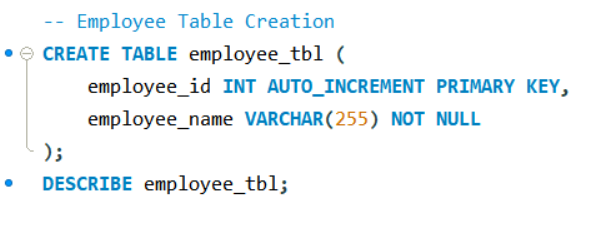

  ### Step - 2 Department Table Query
   
  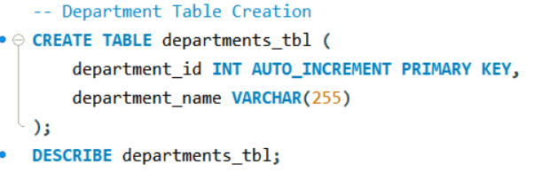

  ### Step - 3 Employee Department Table Query
   
  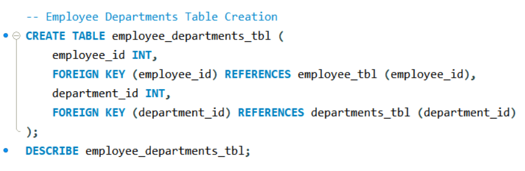

  ### Step - 4 Project Table Query
   
  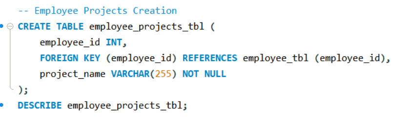

  ### Step - 5 Managers Table Query
   
  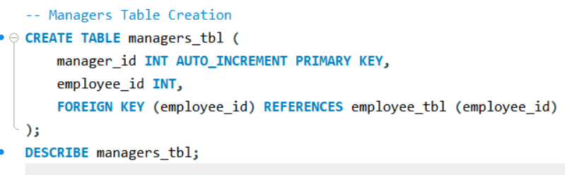

## Table Structures 

  ### Step 1 - Employee Table Structure
   
  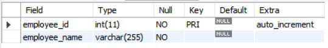

  ### Step 2 - Department Table Structure
   
  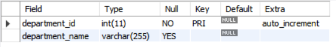

  ### Step 3 - Employee Department Table Structure
   
  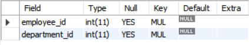

  ### Step 4 - Project Table Structure
   
  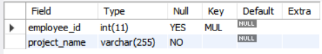

  ### Step 5 - Managers Table Structure
   
  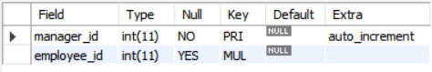

## Entity-Relational Schema
 
  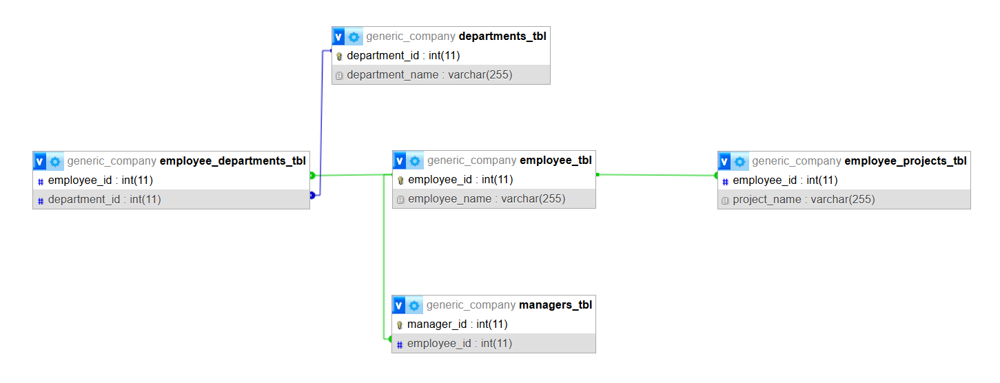
